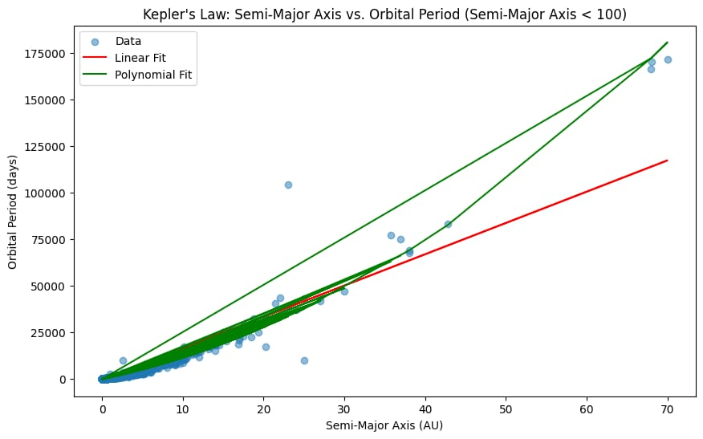
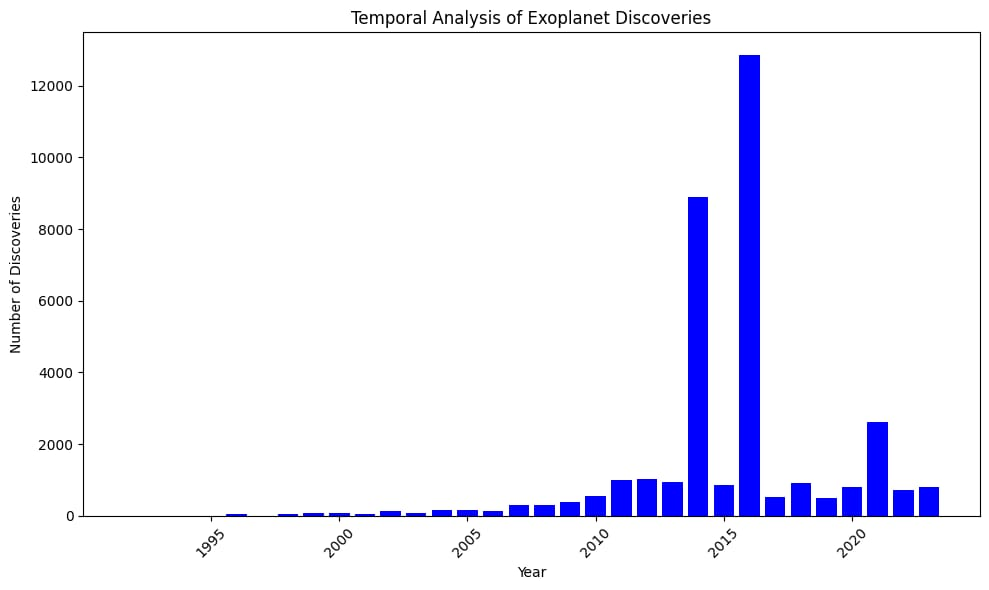
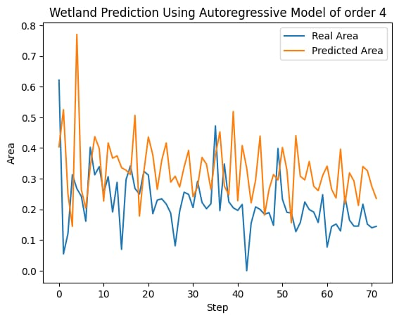

# Yan Barros - Data Scientist and Computational Physicist

## About Me
Passionate about turning data into actionable insights, I am Yan Barros, a Data Scientist with a background in Computational Physics. My journey is characterized by a love for learning, continuous innovation, and expertise in various domains.

## Featured Projects

### Sound Spectrum Analysis for Machine Learning
Developed a machine learning model capable of distinguishing audio spectra with an impressive F1-Score of 82%, recall of 78%, and accuracy of 88%. The model classifies audio spectra into directional commands such as Up, Down, Right, Left, etc.

    
    

### ETL Projects
1. **NASA Dataset Collector:**
   Created a robust web crawler and adapted a PostgreSQL database to gather data from all official NASA datasets.

2. **Space Exploration Image Collector:**
   Developed a crawler to collect all publicly available images from NASA and the European Space Agency websites.

     
    
    

### Physics Informed Neural Networks (PINN)
Built high-accuracy PINNs for various physical equations, including Navier-Stokes, 1D Heat Equation, Lane-Emden Equation, and Stefan-Boltzmann Equation. Leveraged techniques such as Computational Modeling, Symbolic Modeling, Quantum Machine Learning, and AI Explainability.

    
    
    
    
    
    

### Exploratory Data Analysis
Conducted a comprehensive Exploratory Data Analysis (EDA) on NASA's Exoplanet dataset, applying PCA and t-SNE for exoplanet clustering.

    
    
    
    
           
           
           
           
           
           
           
           

### Image Processing for Stars Lightcurves
Utilized image processing techniques to visually represent results from lightcurves of stars.

    
    
           

### Wetlands Drought Predictor
Developed a drought prediction model for wetlands in Iran, incorporating evapotranspiration analysis. The model predicts dry periods, contributing to environmental planning.

    
    
           
           
           

## Connect with Me
- [GitHub](https://www.github.com/barrosyan)
- [LinkedIn](https://www.linkedin.com/in/barrosyan)

Let's collaborate and keep the data flowing!
